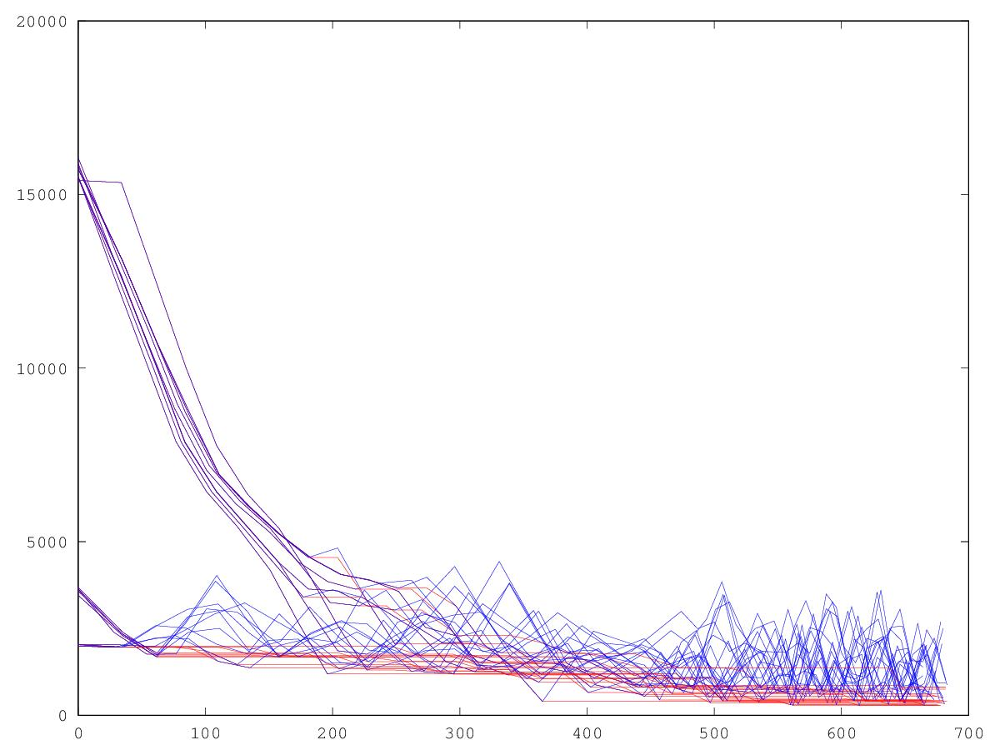
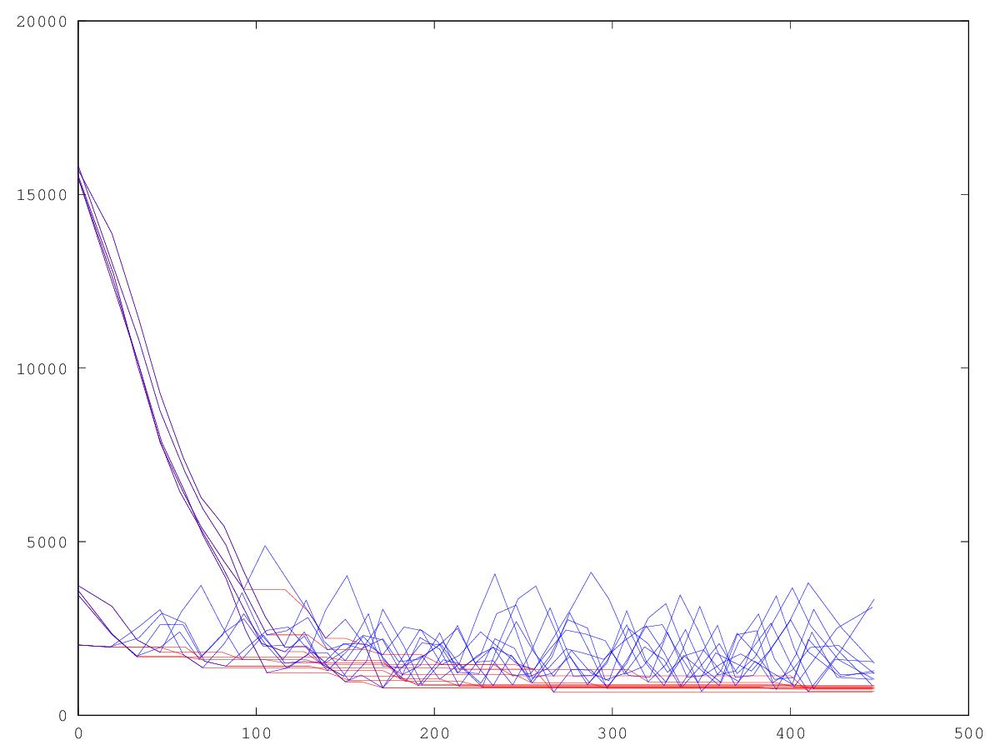
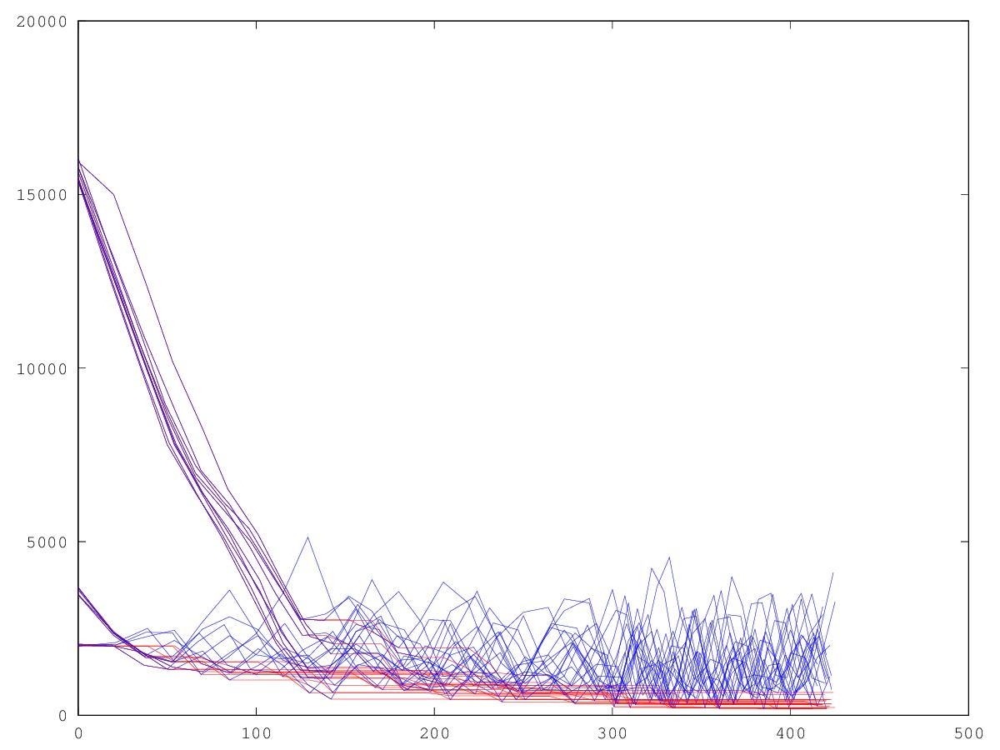
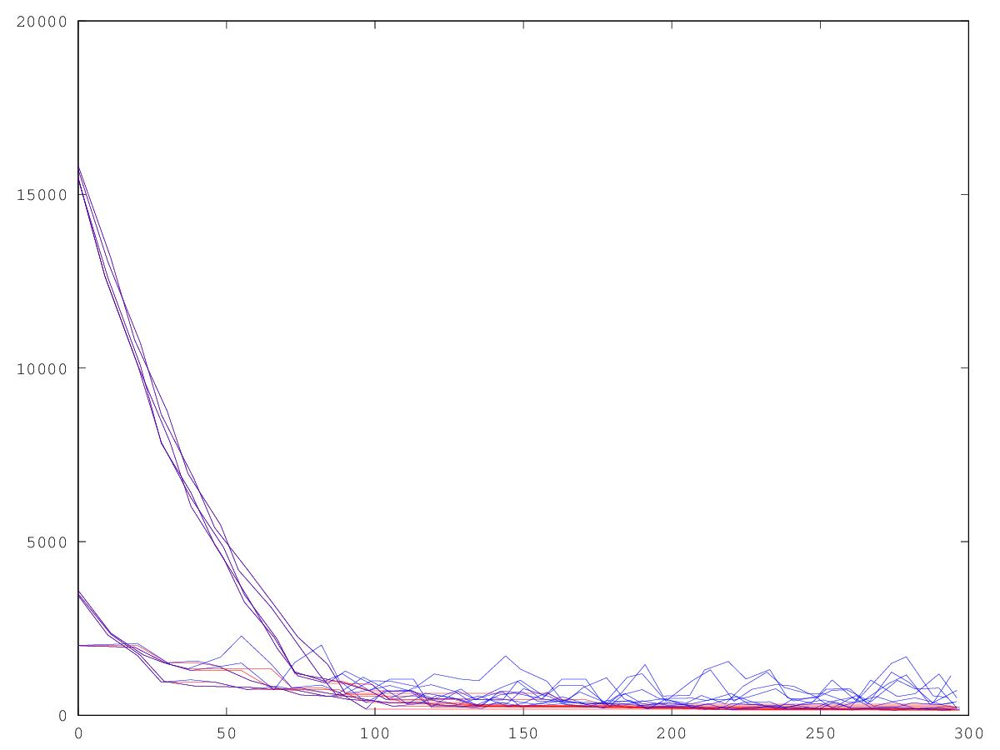
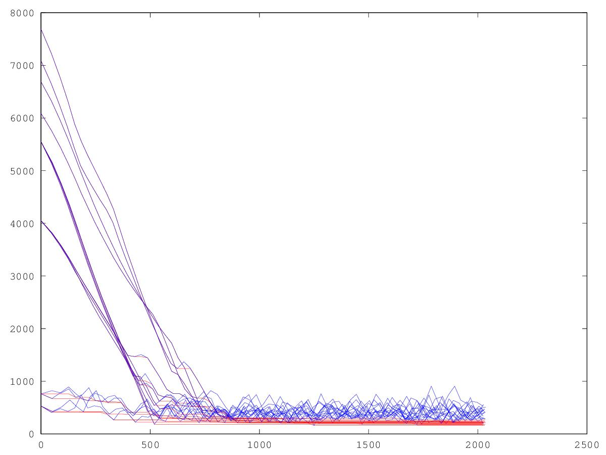
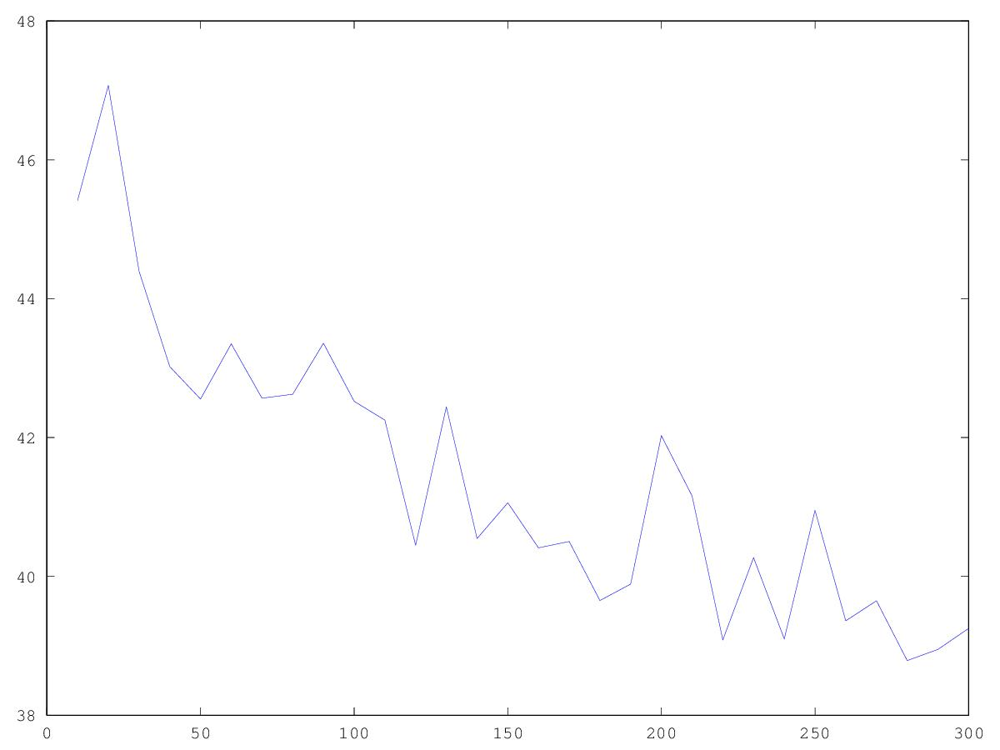
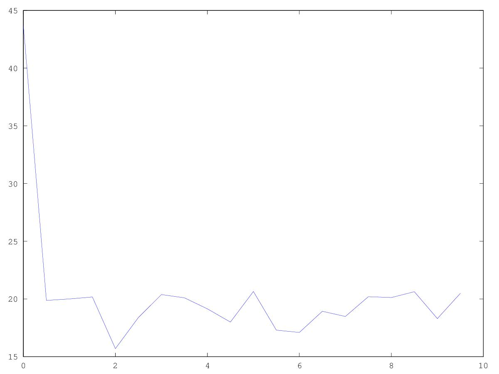
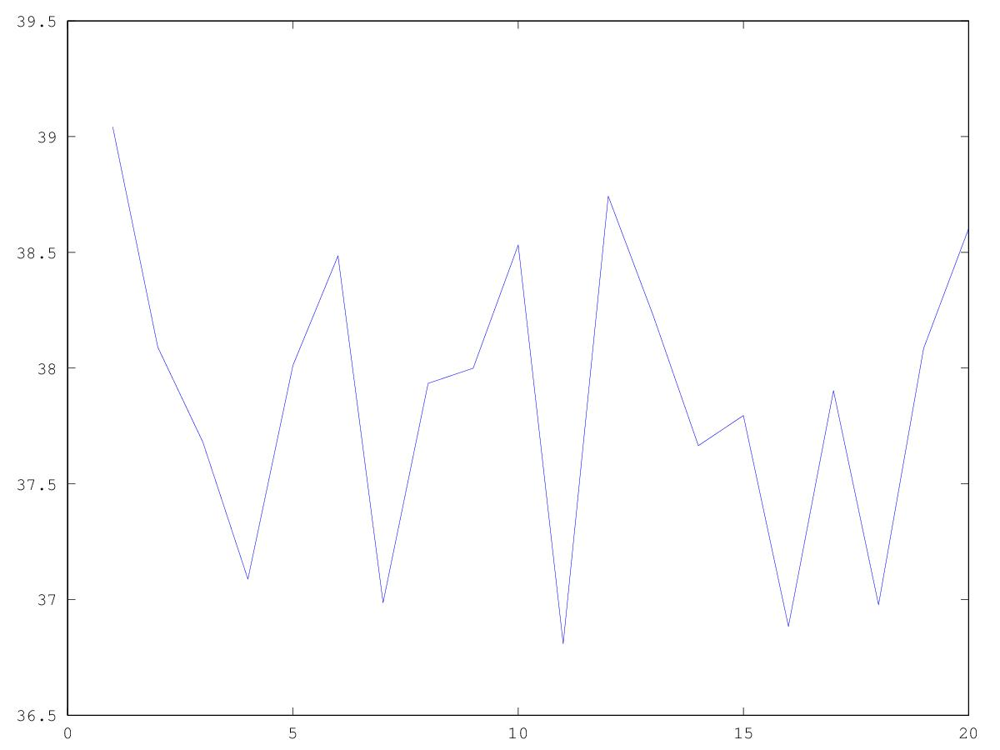

Examples
============

*Note*: You should always start examples from root directory of pylocating.

Federated Particles
-------------------

Two separated environments contain a different number of particles.
All the particles are `PSOParticle` (they follow a standard PSO model).
The initial position of particles are around the beacons.

.. code-block:: bash

  /path/to/pylocating$ scripts/bestfitnessgraph.sh federated_particles 20 10

arguments:
  - 20: the first environment contains 20 particles
  - 10: the second environment contains 10 particles

FollowBest Particles
--------------------

Two connected environments contain a different number of particles.
The first environment contains `GlobalBestPSOParticle` particles (the same of
`PSOParticle`, but in this case the best fitness is the best found by all
environments instead of the best found inside the environment itself).
The second environment contains `FollowBestParticle`; they are special
particles that only search around the globally found best position in that
moment.

.. code-block:: bash

  /path/to/pylocating$ scripts/bestfitnessgraph.sh followbest_particles 20 10

arguments:
  - 20: the first environment contains 20 particles
  - 10: the second environment contains 10 particles

Start from beacon sphere surface
--------------------------------

One single environment contains all particles.
Them are equally distributed around the beacons on the sphere surface with
center the beacon itself and radius the distance measured.
3/4 of all particles are `PSOParticle`. The rest are `FollowBestParticle`.

.. code-block:: bash

  /path/to/pylocating$ scripts/bestfitnessgraph.sh start_from_sphere_surface 16

arguments:
  - 16: the environment contains 16 * 4 (# beacons) particles.

Benchmarks 1 - config 1
-----------------------

Evaluate distance error as a function of swarm size:

- error introduced: 3
- inertial weight: 1
- cognition: 2
- social: 2
- number of particles: range [10, 300]
- max particle velocity: 0.5
- interations per particle: 60

There is only one environmnent where all `PSOParticle` is connected.

The virtual space where the 4 beacons and the point is inserted is defined by:

- center: [1000, 1000, 1000]
- side length: 100

Every time the benchmark is started, their position are chosen randomly inside
this cube.
The distance error introduced is fixed and moved every time in a different
position in the space.
The benchmark is executed 100 times:

.. code-block:: bash

  examples/benchmark_1.config1.sh 100

At the end of execution, you can see `/tmp/benchmark_1.config1.jpg` file generated.

Benchmarks 1 - config 2
-----------------------

Evaluate distance error as a function of social parameter:

- error introduced: 3
- inertial weight: 1
- cognition: 2
- social: range [0, 10]
- number of particles: 100
- max particle velocity: 5
- interations per particle: 60

There is only one environmnent where all `PSOParticle` is connected.

The virtual space where the 4 beacons and the point is inserted is defined by:

- center: [1000, 1000, 1000]
- side length: 100

Every time the benchmark is started, their position are chosen randomly inside
this cube.
The distance error introduced is fixed and moved every time in a different
position in the space.
The benchmark is executed 100 times:

.. code-block:: bash

  examples/benchmark_1.config2.sh 100

At the end of execution, you can see `/tmp/benchmark_1.config2.jpg` file generated.

Benchmarks 2 - config 1
-----------------------

Evaluate distance error as a function of `FollowBestParticle` swarm size:

- error introduced: 3
- inertial weight: 1
- cognition: 2
- social: 2
- number of particles: range 80
- number of particles: range [1, 20]
- max particle velocity: 5
- interations per particle: 60

There are two environmnents:
  - the first where `PSOParticle` are inserted
  - the second where `FollowBestParticle` are inserted

The two environmnents are connected together.

The virtual space where the 4 beacons and the point is inserted is defined by:

- center: [1000, 1000, 1000]
- side length: 100

Every time the benchmark is started, their position are chosen randomly inside
this cube.
The distance error introduced is fixed and moved every time in a different
position in the space.
The benchmark is executed 100 times:

.. code-block:: bash

  examples/benchmark_2.config1.sh 100

At the end of execution, you can see `/tmp/benchmark_2.config1.jpg` file generated.

